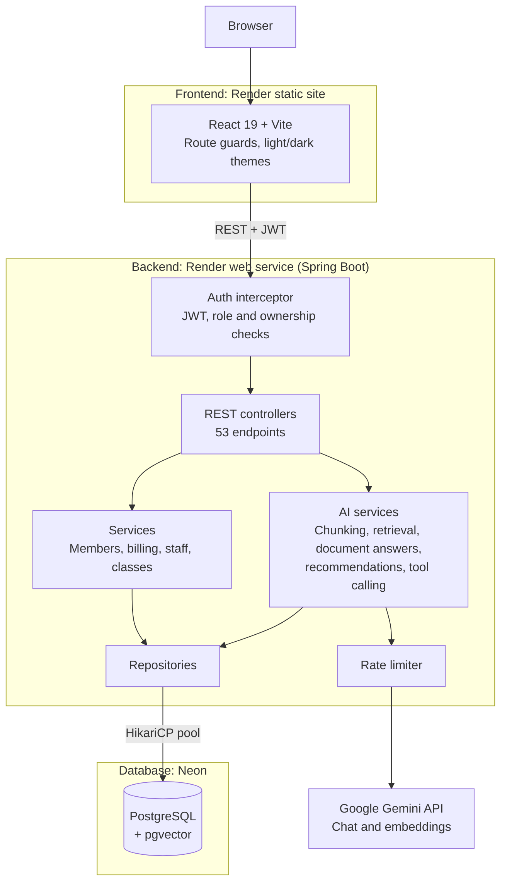

# MyFitness — Gym Management System

A full-stack gym management system with role-based access, membership billing, and an AI assistant that answers from uploaded documents using retrieval-augmented generation (RAG).

**Live app:** https://myfitness-frontend.onrender.com
**API:** https://myfitness-gym-management-system.onrender.com
**API docs:** [Swagger UI](https://myfitness-gym-management-system.onrender.com/swagger-ui.html)

| Role   | Username     | Password      |
|--------|--------------|---------------|
| Admin  | `demo_admin` | `DemoPass123` |
| Member | `dm01_demo`  | `DemoPass123` |

> Hosted on Render's free tier. The first request after a period of inactivity can take 30–60 seconds while the server wakes up.

## Screenshots

<p>
  
  
</p>
<p>
  
  
</p>

## What it does

**Admin**

- Create, edit, and remove members, staff (instructors, full-time, part-time), and bootcamp classes
- Assign memberships and enrol members in classes
- Revenue dashboard and reports calculated from payment and membership data
- CSV export for members and revenue
- AI Assistant with an admin-only document knowledge base

**Member**

- Personal dashboard with membership status and billing history
- Fitness goal tracking
- Class browsing (enrolment is handled by admins)
- AI Assistant with a member-only knowledge base, plus class recommendations based on the member's stated goal

**Both roles**

- Three membership types (Standard, Student Saver, Pay As You Go), each with its own billing rules, and a 7% discount for multi-class enrolment
- Light and dark themes on every page
- Confirmation before destructive actions, and feedback after every change

## Tech stack

| Layer      | Technology |
|------------|------------|
| Backend    | Java 21, Spring Boot 3.2.5 |
| Database   | PostgreSQL on Neon, HikariCP connection pool, pgvector for similarity search |
| Auth       | JWT (JJWT) with BCrypt password hashing |
| AI         | Google Gemini API for chat, tool calling, and embeddings |
| Frontend   | React 19, Vite 8, React Router 7, CSS Modules |
| Testing    | JUnit 5 |
| Deployment | Render (backend web service and static frontend), Neon (database) |

## Architecture



## How it's built

### Authorization is enforced on the server

Role and ownership checks run on the backend for every protected endpoint, through `@RequireRole` and `@RequireOwnership` annotations handled by a shared interceptor. A member cannot read another member's data by changing a URL or request body. The React route guards (`ProtectedRoute`, `RoleRoute`) exist for user experience only; they are not the security boundary.

### Payment status is calculated, not stored

A membership's status (`PAID`, `DUE_SOON`, `OVERDUE`) is computed on read from the due date and today's date. Nothing is written to the database as a status flag, so the status can never disagree with the dates it depends on.

### The AI assistant

- **Document Q&A (RAG).** Uploaded documents are split into overlapping chunks, embedded with Gemini, and stored in pgvector. A question is embedded the same way and matched by cosine distance. The assistant answers only from the retrieved chunks and cites its sources.
- **Refusal.** If no chunk is close enough to the question, the assistant declines and no call is made to Gemini. The cut-off was set from measured distances (about 0.38 for a relevant match and 0.55 for an irrelevant one).
- **Separate knowledge bases.** Admin and member documents are stored apart, so a member's assistant cannot surface admin-only content.
- **Tool calling.** For questions about classes, the model calls a function that queries the live class data instead of relying on retrieved text.
- **Recommendations.** Class suggestions are generated from the member's free-text fitness goal and the classes currently available.
- **Quota protection.** A rate limiter sits in front of every Gemini call, and the model name is set through an environment variable so a deprecated model can be replaced without a code change.

### Database access

The backend uses a HikariCP pool. An earlier version held a single shared connection, which failed when the database closed an idle connection. Member and class lookups originally ran 2N+1 queries per page; they now use batch loading with a fixed number of queries regardless of page size.

### Deployment

The frontend and backend are hosted as two separate services. CORS origins and the API base URL come from environment variables, so the same code runs locally and in production. The static host has a rewrite rule that sends all routes to `index.html`, so refreshing a client-side route works.

## Testing

```bash
mvn test
```

119 tests across 12 test classes, covering service-layer business logic, billing and membership edge cases, authorization, and the AI pipeline.

- **Fakes instead of a mocking framework.** Every repository is an interface, and tests use small hand-written in-memory implementations of them.
- **AI code is tested without network calls.** The Gemini chat and embedding clients sit behind `AiChatClient` and `AiEmbeddingClient` interfaces, so tests substitute fakes and never need an API key.
- **Refusals are verified by behaviour.** The refusal tests check that the fake client received no prompt, which confirms Gemini was not called, in addition to checking the response text.
- **Chunking is pinned down.** Tests cover overlap between consecutive chunks and guarantee the chunking loop terminates on long input.

## Bugs worth mentioning

- **Silent data loss from `INSERT OR REPLACE`.** It deletes and re-inserts the row, which triggered `ON DELETE CASCADE` and removed a member's class enrolments on every update. Replaced with `ON CONFLICT DO UPDATE`.
- **Password hash in API responses.** A public getter on `User` was being serialized into JSON. Excluded with `@JsonIgnore`.
- **A type error the tests could not see.** A `DATE` column was being written with `setString()`. SQLite had tolerated it; PostgreSQL rejected it. Because the tests run against in-memory fakes, they never touched the SQL.
- **Embedding size mismatch.** The embedding API returned 3072-dimension vectors while the column was defined for 768. Fixing the code was not enough, because `ADD COLUMN IF NOT EXISTS` does not change an existing column; the column had to be recreated.
- **Failed deploys that looked healthy.** The host keeps serving the last successful build when a new deploy fails. Four deploys failed on a missing environment variable while the live site appeared to work.

## Known limitations

- Most tests run against in-memory fakes, so SQL-level errors are not caught by the test suite.
- There are no frontend or end-to-end tests yet.
- Members cannot enrol themselves in classes; an admin does it.
- Single gym only. There is no multi-tenancy.
- Payments are recorded in the system, not processed through a payment provider.
- Free-tier hosting means cold starts, and the Gemini free tier has a daily request limit.

## Running locally

**Backend**

Requires Java 21, Maven, and a PostgreSQL database with pgvector available (Neon works).

```bash
git clone https://github.com/aqsak-dev99/MyFitness-Gym-Management-System.git
cd MyFitness-Gym-Management-System

export DATABASE_URL=<your-postgres-connection-string>
export GEMINI_API_KEY=<your-gemini-api-key>
export JWT_SECRET=<any-long-random-string>
export GEMINI_MODEL=<gemini-model-name>   # optional

mvn clean package
java -jar target/myfitness.jar
```

The backend runs on http://localhost:8080.

**Frontend**

```bash
cd frontend
npm install
npm run dev
```

The frontend runs on http://localhost:5173 and uses `localhost:8080` as the API by default.

## API

53 REST endpoints across Members, Staff, Bootcamp Classes, Memberships, Payments, Documents, AI, and Auth. Interactive documentation is at `/swagger-ui.html` on the running backend.

## License

MIT
